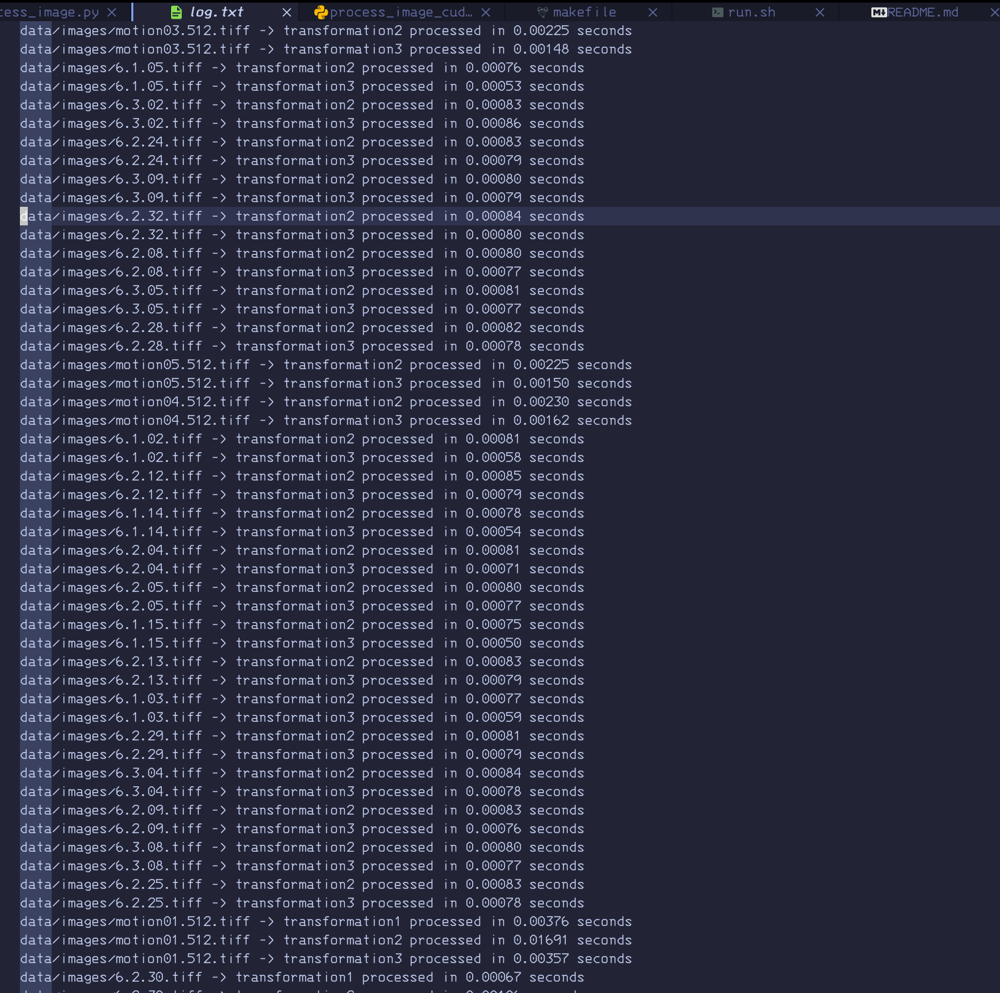

# Image Processing with CUDA and Python

## Project Overview
This project is designed to perform image processing on `.tiff` images using Python. The script applies three different transformations to each image and saves the results in separate directories. Additionally, the project logs the steps performed and the time taken for each transformation.

## Goals
- To automate image processing using CUDA and Python.
- To apply three specific transformations to each image:
  1. Grayscale Conversion
  2. Gaussian Blur
  3. Canny Edge Detection
- To save the transformed images in corresponding directories.
- To log the processing steps and time taken for each image transformation.

## Project Structure
ImageProcessing/
├── data/
│ ├── images/ (for original image data)
│ ├── transformation1/ (output of first transformation)
│ ├── transformation2/ (output of second transformation)
│ └── transformation3/ (output of third transformation)
├── scripts/
│ └── process_images.py (Python script for processing images)
  └── process_images_cuda.py (Python script for processing images)
├── results/
│ └── log.txt (log file recording steps and time taken)
├── requirements.txt (list of dependencies)
├── Makefile (make commands for setup and execution)
└── README.md (this guide)

## Prerequisites
Before you begin, ensure you have met the following requirements:
- You have installed Python 3.x.
- You have installed the CUDA Toolkit.
- You have installed the following Python libraries:
  - `numba`
  - `opencv-python-headless`
  - `numpy`
  - `numda`

To install these libraries, run:
```bash
pip install numba opencv-python-headless numpy numda
```

Or 
```bash
make all
```

Transformations Applied
Sobel Filter: Detects edges in the image using the Sobel operator.
Gaussian Blur: Applies a Gaussian blur to the image.
Canny Edge Detection: Applies Canny edge detection.
Example Transformations
Here are examples of the transformations applied to a sample image:

Original Image:
[Original Image](data/images/motion01.512.tiff)

Sobler Conversion:
[Sobler Transformation](data/transformation1/motion01.512.tiff)

Gaussian Blur:
[Gaussian Transformation](data/transformation2/motion01.512.tiff)

Canny Edge Detection:
[Canny Edge Transformation](data/transformation3/motion01.512.tiff)

Log File
The log file results/log.txt contains entries like:


This log file records the processing steps and time taken for each image transformation.

Results
After running the script, the processed images will be saved in the following directories:

data/transformation1/
data/transformation2/
data/transformation3/
The log file recording the steps and time taken will be located at [log file](results/log.txt).

## Conclusion
This guide helps you set up and run an image processing project using Python. The script performs three transformations on each .tiff image and logs the processing steps and time taken. Follow the instructions to process your images and review the results in the respective directories.

For any further questions or issues, please refer to the documentation or contact the project maintainers.
